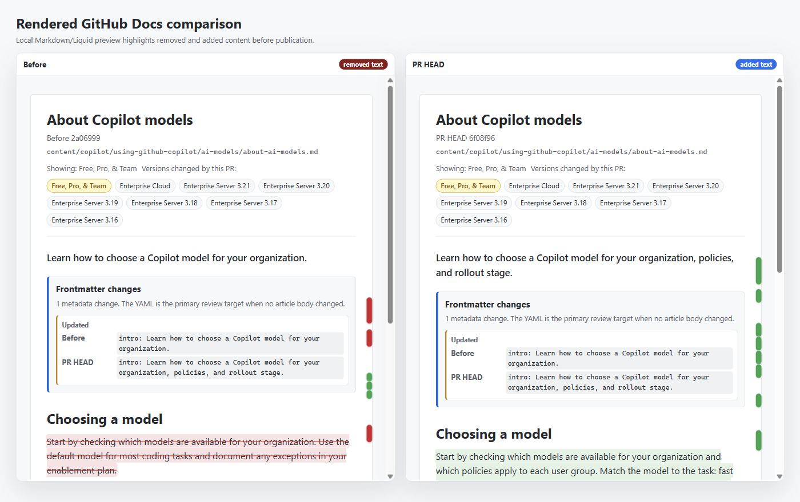
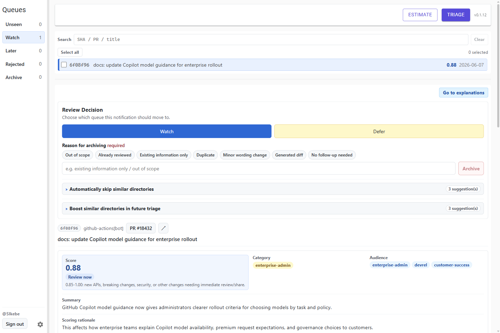
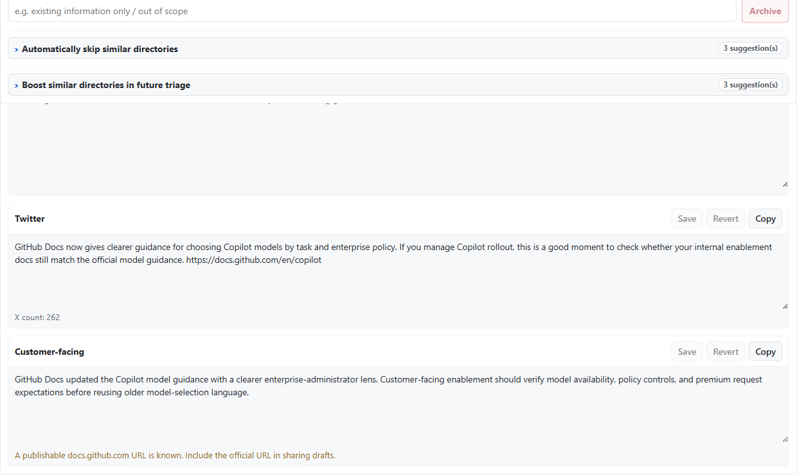

# RepoSyncRadar

RepoSyncRadar is a Windows desktop app for GitHub Enterprise Cloud administrators who need to review [`github/docs`](https://github.com/github/docs) Repo sync changes and decide which documentation updates deserve operational attention.

It combines deterministic ingestion of Repo sync PRs with GitHub Copilot SDK triage, local review history, rendered docs previews, and sharing-draft generation so a daily docs review can fit into a short operator workflow.

> [!IMPORTANT]
> RepoSyncRadar is a review aid for administrators. It does not replace official GitHub release notes, GitHub Changelog posts, support guidance, or human approval before communicating changes.



## What it does

- Ingests recent `github/docs` Repo sync PRs and stores commit, file, scoring, review, ignore-rule, and draft data in SQLite.
- Uses the **GitHub Copilot SDK** to run Morning Triage, score candidate commits, and generate review summaries.
- Keeps operator decisions explicit with **Unseen**, **Watch**, **Later**, **Rejected**, **Archive**, directory ignore rules, and importance boost data.
- Maps changed docs paths to `docs.github.com` URLs so reviewers can jump from a commit to the public article context.
- Renders local before/after Markdown previews for docs changes through the app's .NET Markdown/Liquid pipeline and WebView2, without requiring Node.js.
- Generates human-reviewed sharing drafts for short-form updates and customer-facing notices.
- Authenticates with GitHub OAuth Device Flow and stores the resulting token locally with Windows DPAPI.
- Supports installed-package updates through Velopack release feeds.

## Screenshots

### Triage dashboard



### Sharing drafts



## Requirements

| Requirement | Notes |
|---|---|
| Windows | Windows 11 is the primary target. WebView2 Runtime is required and is normally preinstalled. |
| GitHub account | The signed-in account must have an active GitHub Copilot subscription. |
| Git | Optional for basic triage, but required for local docs preview because the app reads `github/docs` content by commit SHA from a bare clone. |

The installed app is self-contained and does not require a separate .NET Desktop Runtime. The Copilot CLI used by the SDK is supplied by the `GitHub.Copilot.SDK` package and is prepared automatically at runtime.

## Install and run

1. Download the latest `SIkebe.RepoSyncRadar-*-Setup.exe` from the [Releases page](https://github.com/SIkebe/RepoSyncRadar/releases/latest). Choose the asset that matches your Windows architecture and channel, such as `win-x64-stable` or `win-arm64-stable`.
2. Run the installer and launch **RepoSyncRadar** from the Start Menu.
3. Complete GitHub OAuth Device Flow on first launch. The app opens GitHub's device login page, copies the user code to the clipboard, and stores the resulting token in `%LocalAppData%\RepoSyncRadar\github-token.bin` using Windows DPAPI.
4. Press **Triage** to ingest recent `github/docs` Repo sync PRs and let Copilot score candidate changes.

Distribution builds include the public RepoSyncRadar OAuth Client ID. Organizations that require a managed OAuth App can override `Copilot:OAuthClientId` in `%LocalAppData%\RepoSyncRadar\appsettings.local.json` or with `RADAR_Copilot__OAuthClientId`.

Installed builds can check Velopack update feeds and apply newer releases without rebuilding from source.

## Daily workflow

1. Start the app and confirm the header shows a signed-in GitHub user.
2. Run **Triage** to fetch Repo sync PRs, ingest new commits, and let Copilot score likely operator-impacting changes.
3. Review the **Unseen** queue, then mark commits as **Watch**, **Later**, **Rejected**, or **Archive**.
4. Open changed docs URLs or use local preview for Markdown changes where a rendered before/after comparison is useful.
5. For focused commits, generate or copy sharing drafts, then make the final human decision outside the app.

Local preview is opt-in. By default, startup does not clone or fetch `github/docs`; preview work begins only when a preview action needs it, unless `DocsRepository:PrewarmOnStartup` is set to `true`.

## Configuration

Installed builds read per-user overrides from `%LocalAppData%\RepoSyncRadar\appsettings.local.json`. Source builds can also use `src\RepoSyncRadar.App\appsettings.local.json`. The committed defaults live in [`src\RepoSyncRadar.App\appsettings.json`](src/RepoSyncRadar.App/appsettings.json).

Key settings:

| Section | Purpose |
|---|---|
| `GitHub` | Source repo, Repo sync title filter, maximum PR count, and optional PR-created cutoff. |
| `DocsApi` | `docs.github.com` API base address and page-list cache settings. |
| `Copilot` | Default Copilot model, SDK telemetry, remote-session toggle, OAuth Client ID, and OAuth scopes. |
| `WebView` | Host allow-list for docs, GitHub, assets, and GitHub Copilot Chat traffic inside WebView2. |
| `DocsRepository` | `github/docs` clone URL, preview prewarm toggle, preview base port, and preview timeout. |
| `Updates` | Velopack update-feed behavior for installed builds. |

For a full setup walkthrough, OAuth details, local-preview behavior, and release-update notes, see [`docs/USAGE.md`](docs/USAGE.md).

## Develop from source

Source builds require the preview .NET SDK pinned in [`global.json`](global.json): `11.0.100-preview.7.26381.103` with prerelease roll-forward enabled.
Agent skills are managed by [APM](https://microsoft.github.io/apm/). Run `apm install` after cloning so the pinned Modern Web Guidance skill in [`apm.yml`](apm.yml) is restored from [`apm.lock.yaml`](apm.lock.yaml).

### GitHub Copilot app

On Windows, add this repository as a project in the GitHub Copilot app and review and accept the repository configuration when prompted. Creating a session automatically restores the solution. Select **Run RepoSyncRadar** from the project scripts to launch the desktop app; **Build** and **Test** are available from the same menu.

The project scripts are defined in [`.github/github-app.yml`](.github/github-app.yml). The app intentionally does not auto-open a browser because RepoSyncRadar is a WPF desktop application.

### Terminal

```powershell
git clone <this-repo-url> C:\github\RepoSyncRadar
cd C:\github\RepoSyncRadar
irm https://aka.ms/apm-windows | iex
apm install
apm audit --ci --no-fail-fast
dotnet restore
dotnet build RepoSyncRadar.sln -warnaserror
dotnet run --project src\RepoSyncRadar.App
```

## Project layout

```text
src/
  RepoSyncRadar.App/       WPF startup assembly, Blazor UI, Copilot orchestration, auth, preview UI, update UI
  RepoSyncRadar.Core/      EF Core models, options, service interfaces, GitHub/docs clients, preview rendering
tests/
  RepoSyncRadar.App.Tests/            bUnit, UI component, Copilot workflow, auth, preview, and style tests
  RepoSyncRadar.Core.Tests/           Core model, data, service, resolver, preview, and sanitization tests
  RepoSyncRadar.Integrations.Tests/   External-facing service integration tests
  RepoSyncRadar.App.E2E.Tests/        WebView/WPF-oriented end-to-end tests
docs/
  DESIGN.md                  Product design and architecture notes
  USAGE.md                   Setup and operator guide
  RELEASE.md                 Packaging, release, and update-feed details
  IMPLEMENTATION_PLAN.md     Historical implementation checklist
```

## Build and test

```powershell
dotnet build RepoSyncRadar.sln -warnaserror
dotnet test RepoSyncRadar.sln --timeout 10m -- --filter-not-trait Category=Manual
```

Manual tests are intentionally excluded from the default test command. Automated WebView/WPF coverage lives in `tests\RepoSyncRadar.App.E2E.Tests` and uses the `Category=E2E` trait.

## Release packaging

RepoSyncRadar uses Velopack for installed Windows releases and update feeds. The release workflow publishes installer/update-feed assets rather than portable bundles.

For local package validation, use:

```powershell
.\scripts\Build-VelopackRelease.ps1 -NoPortable -NoLegacyManifest
```

See [`docs/RELEASE.md`](docs/RELEASE.md) for release channels, asset expectations, and installed-package smoke guidance.

## Further reading

- [`docs/DESIGN.md`](docs/DESIGN.md) explains the product goals, architecture, Copilot SDK integration, data model, and preview strategy.
- [`docs/USAGE.md`](docs/USAGE.md) is the operator guide for setup, OAuth, daily review, local preview, and updates.
- [`docs/PUBLIC_RELEASE_READINESS.md`](docs/PUBLIC_RELEASE_READINESS.md) tracks public-release blockers and follow-ups.

## License

[MIT License](LICENSE)
